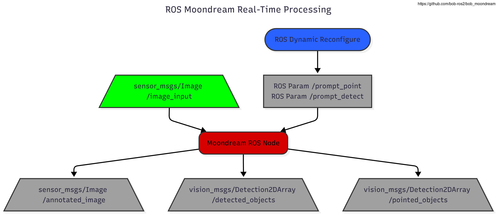

# Moondream ROS Node

This ROS 2 package provides a node that serves as a wrapper for the [`vikhyatk/moondream2`](https://huggingface.co/vikhyatk/moondream2), a small but powerful **vision-language model (VLM)**. The `bob_moondream` node subscribes to a raw image topic and exposes a flexible ROS 2 interface for various **visual reasoning and perception tasks**.

The node loads the model into memory upon startup and processes the latest received image when a service is called or a prompt is published on a topic. It can perform image captioning, answer visual questions, detect objects based on a text description, and locate the center point of an object based on a textual description. It can also publish detection results and an annotated video feed for visualization.

-   [Share on LinkedIn](https://www.linkedin.com/shareArticle?mini=true&url=https%3A%2F%2Fgithub.com%2Fbob-ros2%2Fbob_moondream&title=bob_moondream%3A%20A%20ROS%202%20wrapper%20for%20the%20Moondream2%20VLM&summary=This%20ROS%202%20package%20provides%20a%20flexible%20interface%20for%20the%20Moondream2%20Vision-Language%20Model%2C%20enabling%20visual%20reasoning%20and%20perception%20tasks%20for%20robotics%20applications.)
-   [Share on Reddit](https://www.reddit.com/submit?url=https%3A%2F%2Fgithub.com%2Fbob-ros2%2Fbob_moondream&title=I%20created%20a%20ROS%202%20wrapper%20for%20the%20Moondream2%20Vision-Language%20Model)
-   [Share on Hacker News](https://news.ycombinator.com/submitlink?u=https%3A%2F%2Fgithub.com%2Fbob-ros2%2Fbob_moondream&t=Show%20HN%3A%20A%20ROS%202%20wrapper%20for%20the%20Moondream2%20VLM)
-   [Share on X](https://twitter.com/intent/tweet?url=https%3A%2F%2Fgithub.com%2Fbob-ros2%2Fbob_moondream&text=Check%20out%20bob_moondream%2C%20a%20ROS%202%20wrapper%20for%20the%20Moondream2%20Vision-Language%20Model!&hashtags=ROS%2CRobotics%2CAI%2CVLM%2CComputerVision)

## Overview




### Model Loading

On the **first launch**, the node will automatically download the model weights from the Hugging Face Hub and save them to a local cache directory. This process requires an internet connection and may take a few minutes depending on your network speed. The total download size is approximately **3-4 GB**.

The download location is determined by the `cache_dir` parameter, which defaults to a `models` folder inside the directory where the node is launched.

When loaded onto a GPU (the default behavior), the model consumes approximately **4 GB of VRAM**. Ensure your GPU has sufficient memory available.

Subsequent launches of the node will be much faster, as the model will be loaded directly from this local cache, allowing for offline operation after the initial download.


## Dependencies

### ROS 2 Dependencies

This package depends on several standard ROS 2 message packages and a custom message package. Ensure they are available in your ROS 2 workspace.

-   `std_msgs`
-   `sensor_msgs`
-   `vision_msgs`
-   [`bob_moondream_msgs`](https://github.com/bob-ros2/bob_moondream_msgs): This custom service message package must be located and built within the same workspace as `bob_moondream`.

### Python Dependencies

It is highly recommended to use a Python virtual environment (`venv`) to manage these dependencies and avoid conflicts with other projects or system packages.

The node requires several Python packages to run the vision-language model. These are listed in `requirements.txt` and can be installed using pip:

```bash
pip install -r requirements.txt
```

This will install key libraries such as `transformers`, `torch`, and `Pillow`.

## Build Instructions

To build the `bob_moondream` package, follow these steps:

1.  **Create a ROS 2 Workspace:**
    If you don't have one already, create a new ROS 2 workspace.
    ```bash
    mkdir -p ~/ros2_ws/src
    cd ~/ros2_ws
    ```

2.  **Clone the Repositories:**
    Clone this package and its message dependency into the `src` directory.
    ```bash
    cd src
    git clone https://github.com/bob-ros2/bob_moondream.git
    git clone https://github.com/bob-ros2/bob_moondream_msgs.git
    ```

3.  **Install Python Dependencies:**
    Navigate to the `bob_moondream` package and install the required Python packages.
    ```bash
    cd bob_moondream
    pip install -r requirements.txt
    cd ../.. 
    ```

4.  **Build the Workspace:**
    Use `colcon` to build the packages.
    ```bash
    colcon build
    ```

5.  **Source the Workspace:**
    Before running any nodes, source your workspace's setup file.
    ```bash
    source install/setup.bash
    ```

## Usage

### Prerequisites

Before launching the `moondream` node, ensure you have a source of images being published to the `image_input` topic. This can be from a real camera driver or a rosbag file.

#### Option 1: Using a Standard Camera Driver

For example, to run a USB camera node:
```bash
# You may need to install a camera driver first
# sudo apt install ros-humble-usb-cam

# Launch the camera node and remap its output to image_input
ros2 run usb_cam usb_cam_node_exe --ros-args -r image_raw:=image_input
```

#### Option 2: Using the Provided Launch File

This package includes a convenience launch file that starts a camera node and automatically handles the topic remapping for you. This launch file uses `topic_tools` to throttle the image stream for better performance. Ensure it is installed first:

```bash
# For ROS 2 Humble
sudo apt install ros-humble-topic-tools
```

Once installed, you can run the launch file:
```bash
ros2 launch bob_moondream camera.launch.py
```

### Launching the Node

Once your workspace is sourced and an image feed is active, open a new terminal and run the following command to start the node.

**Basic Launch with remapping:**
```bash
ros2 run bob_moondream moondream --ros-args -r image_input:=/camera/image_raw/throttled -r __ns:=/vision
```
On the first run, this will trigger the model download, which can take several minutes.

**Launch on CPU:**
To run the model on the CPU, use the `device` parameter:
```bash
ros2 run bob_moondream moondream --ros-args -p device:=cpu
```
Once the node is running and has loaded the model, you can interact with it using the services or the interactive script.

### Real-time Detection and Pointing

You can enable continuous detection or pointing on the live image stream by setting the `prompt_detect` and `prompt_point` parameters at runtime. The node will process every incoming image frame with the provided prompt.

**To start real-time object detection:**
Open a new terminal and use the `ros2 param set` command to provide a detection prompt. For example, to continuously look for a cup:
```bash
ros2 param set /moondream prompt_detect "the cup"
```
The node will now publish bounding boxes to `/detected_objects` and the annotated video to `/annotated_image`.

**To start real-time pointing:**
Similarly, you can ask the model to continuously point to a specific feature:
```bash
ros2 param set /moondream prompt_point "the tip of the pen"
```
The node will publish center points to `/pointed_objects`.

**To stop real-time processing:**
To disable the continuous processing, simply set the parameter to an empty string:
```bash
ros2 param set /moondream prompt_detect ""
```

## Interactive Query Script (`query.sh`)

The package includes a convenient helper script, `query.sh`, for interacting with the node's topic-based interface directly from the command line. This script allows you to send prompts and see the results in real-time without needing to write a separate node.

### How to Use

To use the script, run it with `ros2 run` and specify the type of query you want to perform.

**Syntax:**
```bash
ros2 run bob_moondream query.sh <type> [<namespace>]
```

-   **`<type>`**: The mode of interaction. Must be one of `visual_query`, `object_detection`, or `pointing`.
-   **`[<namespace>]`**: (Optional) The ROS 2 namespace where the topics are located. Defaults to `/vision`.

### Example

To start a visual query session, launch the `moondream_node` and a camera feed. Then, in a new terminal, run the following command:

```bash
$ ros2 run bob_moondream query.sh visual_query
--- Listening for results on /vision/visual_query_result
--- Enter your prompt below (Press Ctrl+C to exit)
> what do you see
"A man is sitting at a desk, working on a computer. He is focused on his task..."
>
```
```bash
$ ros2 run bob_moondream query.sh object_detection
--- Listening for results on /vision/object_detection_result
--- Enter your prompt below (Press Ctrl+C to exit)
> mark the cups
'[{"x_min": 0.19673718698322773, "y_min": 0.6845761351287365, "x_max": 0.25443468801677227, "y_max": 0.8037051148712635}, {"x_min": 0.3479478508234024, "y_min": 0.6667342223227024, "x_max": 0.4118177741765976, "y_max": 0.7707657776772976}'
>
```
## Parameters

| Parameter | Type | Default | Description |
|---|---|---|---|
| `model_name` | `string` | `"vikhyatk/moondream2"` | The name of the model on the Hugging Face Hub. |
| `model_revision` | `string` | `"2025-05-20"` | The specific model revision (git commit hash or tag) to use. |
| `cache_dir` | `string` | `"./models"` | The local directory where the model will be downloaded and cached. |
| `frame_id` | `string` | `"moondream"` | The frame ID to be used in the headers of published messages. |
| `device` | `string` | `"cuda"` | The device to run the model on (e.g., "cuda" for GPU, "cpu" for CPU). |
| `prompt_point` | `string` | `""` | If set, continuously runs pointing detection on every new image frame. |
| `prompt_detect` | `string` | `""` | If set, continuously runs object detection on every new image frame. |

## Subscribers

| Topic | Message Type | Description |
|---|---|---|
| `image_input` | `sensor_msgs/msg/Image` | The main input topic for raw images that will be processed by the model. |
| `visual_query_prompt` | `std_msgs/msg/String` | Receives a text prompt to ask a question. The answer is published on `visual_query_result`. |
| `object_detection_prompt` | `std_msgs/msg/String` | Receives a text prompt to detect an object. The result is published on `object_detection_result`. |
| `pointing_prompt` | `std_msgs/msg/String` | Receives a text prompt to find a point. The result is published on `pointing_result`. |

## Publishers

| Topic | Message Type | Description |
|---|---|---|
| `detected_objects` | `vision_msgs/msg/Detection2DArray` | Publishes bounding boxes of detected objects. |
| `pointed_objects` | `vision_msgs/msg/Detection2DArray` | Publishes points of interest (as zero-size bounding boxes). |
| `annotated_image` | `sensor_msgs/msg/Image` | Publishes the input image with detections drawn on it. |
| `visual_query_result` | `std_msgs/msg/String` | Publishes the text answer from a visual query. |
| `object_detection_result` | `std_msgs/msg/String` | Publishes object detection results as a JSON string. |
| `pointing_result` | `std_msgs/msg/String` | Publishes pointing results as a JSON string. |

## Services

| Service Name | Service Type | Description |
|---|---|---|
| `caption` | `bob_moondream_msgs/srv/VisualQuery` | Generates a caption for the latest image. The `prompt` is ignored. |
| `visual_query` | `bob_moondream_msgs/srv/VisualQuery` | Asks a question (`prompt`) about the latest image. |
| `object_detection` | `bob_moondream_msgs/srv/VisualQuery` | Detects objects described by the `prompt`. Returns a JSON string. |
| `pointing` | `bob_moondream_msgs/srv/VisualQuery` | Finds points of interest described by the `prompt`. Returns a JSON string. |
